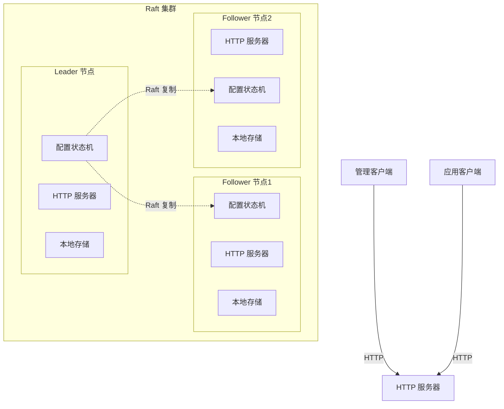

# Design Document: 分布式配置中心

## Overview

本设计文档描述了基于 SOFAJRaft 实现的分布式配置中心示例。该配置中心利用 Raft 协议保证配置数据的强一致性，为分布式系统提供可靠的配置管理服务。

设计遵循 SOFAJRaft 的架构模式，参考现有的 counter 示例，实现配置的 CRUD 操作、命名空间管理、版本控制等核心功能。

## Architecture

### 整体架构



### 核心组件

1. **ConfigServer**: 配置中心服务端，包含 Vert.x HTTP 服务器和 Raft 节点
2. **ConfigStateMachine**: 基于 Raft 的状态机，处理配置操作
3. **AdminClient**: 管理客户端，用于配置的增删改操作
4. **AppClient**: 应用客户端，用于一致性读取配置信息
5. **ConfigStorage**: 配置数据内存存储层
6. **HttpServer**: 基于 Vert.x 的 HTTP 服务器，处理客户端请求

## Components and Interfaces

### ConfigServer

配置中心服务端，包含 HTTP 服务器和 Raft 节点。

```java
public class ConfigServer {
    private RaftGroupService raftGroupService;
    private Node node;
    private ConfigStateMachine fsm;
    private HttpServer httpServer;
    
    public boolean start(ConfigServerOptions opts);
    public void shutdown();
}
```

### HttpServer

HTTP 服务器，使用 Vert.x 处理客户端的 REST 请求。

```java
public class HttpServer {
    private Vertx vertx;
    private io.vertx.core.http.HttpServer server;
    private ConfigStateMachine stateMachine;
    private Node node;
    
    public void start(int port);
    public void stop();
    
    // 处理写操作（需要通过 Raft 提交）
    private void handlePutConfig(RoutingContext context);
    private void handleDeleteConfig(RoutingContext context);
    
    // 处理读操作（使用 ReadIndex 一致性读）
    private void handleGetConfig(RoutingContext context);
    private void handleListConfigs(RoutingContext context);
}
```

### ConfigStateMachine

实现 StateMachine 接口，处理配置操作的状态机。

```java
public class ConfigStateMachine extends StateMachineAdapter {
    private ConfigStorage storage;
    
    @Override
    public void onApply(Iterator iter);
    
    @Override
    public void onSnapshotSave(SnapshotWriter writer, Closure done);
    
    @Override
    public boolean onSnapshotLoad(SnapshotReader reader);
}
```

### AdminClient

管理客户端，用于配置的增删改操作。

```java
public class AdminClient {
    private String serverUrl;
    private HttpClient httpClient;
    
    // 同步接口
    public ConfigResponse putConfig(String namespace, String key, String value);
    public ConfigResponse deleteConfig(String namespace, String key);
    public ConfigResponse listConfigs(String namespace);
    
    // 异步接口
    public void putConfigAsync(String namespace, String key, String value, 
                              ConfigCallback callback);
    public void deleteConfigAsync(String namespace, String key, 
                                 ConfigCallback callback);
}
```

### AppClient

应用客户端，用于读取配置信息，使用 ReadIndex 确保一致性读。

```java
public class AppClient {
    private String serverUrl;
    private HttpClient httpClient;
    private ScheduledExecutorService scheduler;
    
    // 一致性读接口（使用 ReadIndex）
    public ConfigResponse getConfig(String namespace, String key);
    public ConfigResponse getConfigByVersion(String namespace, String key, long version);
    
    // 轮询接口
    public void startPolling(String namespace, String key, 
                           long intervalMs, ConfigChangeListener listener);
    public void stopPolling(String namespace, String key);
}
```

### ConfigStorage

配置数据内存存储接口，数据持久化由 SOFAJRaft 日志机制保证。

```java
public interface ConfigStorage {
    void putConfig(String namespace, String key, ConfigEntry entry);
    ConfigEntry getConfig(String namespace, String key);
    boolean deleteConfig(String namespace, String key);
    List<ConfigEntry> listConfigs(String namespace);
    
    List<ConfigEntry> getConfigHistory(String namespace, String key);
    ConfigEntry getConfigByVersion(String namespace, String key, long version);
    
    // 快照相关方法
    void saveSnapshot(OutputStream output) throws IOException;
    void loadSnapshot(InputStream input) throws IOException;
}
```

## Data Models

### ConfigEntry

配置项数据模型，包含配置值和元数据。一个配置项可以包含多个属性。

```java
public class ConfigEntry implements Serializable {
    private String namespace;
    private String key;
    private Map<String, String> properties; // 配置属性键值对
    private long version;
    private long createTime;
    private long updateTime;
    private boolean deleted;
    
    // 构造函数、getter、setter 方法
    
    // 便利方法
    public String getProperty(String propertyKey);
    public void setProperty(String propertyKey, String propertyValue);
    public Set<String> getPropertyKeys();
}
```

### ConfigRequest

客户端请求数据模型，简化操作类型。

```java
public class ConfigRequest implements Serializable {
    public enum Type {
        PUT_CONFIG,
        GET_CONFIG,
        DELETE_CONFIG,
        LIST_CONFIGS,
        GET_CONFIG_HISTORY,
        GET_CONFIG_BY_VERSION,
        ROLLBACK_CONFIG
    }
    
    private Type type;
    private String namespace;
    private String key;
    private Map<String, String> properties; // 配置属性
    private long version;
    
    // 构造函数、getter、setter 方法
}
```

### ConfigResponse

服务端响应数据模型。

```java
public class ConfigResponse implements Serializable {
    private boolean success;
    private String errorMsg;
    private ConfigEntry configEntry;
    private List<ConfigEntry> configEntries;
    
    // 构造函数、getter、setter 方法
    
    public static ConfigResponse success(ConfigEntry entry) {
        ConfigResponse response = new ConfigResponse();
        response.success = true;
        response.configEntry = entry;
        return response;
    }
    
    public static ConfigResponse error(String errorMsg) {
        ConfigResponse response = new ConfigResponse();
        response.success = false;
        response.errorMsg = errorMsg;
        return response;
    }
}
```

### ConfigServerOptions

服务端配置选项。

```java
public class ConfigServerOptions {
    private String dataPath;
    private String groupId;
    private String serverId;
    private String initialServerList;
    private int port;
    
    // 构造函数、getter、setter 方法，提供默认值
}
```

### AdminClientOptions

管理客户端配置选项。

```java
public class AdminClientOptions {
    private String serverUrl;
    private int timeoutMs;
    private int maxRetries;
    
    // 构造函数、getter、setter 方法，提供默认值
    public AdminClientOptions() {
        this.timeoutMs = 5000;
        this.maxRetries = 3;
    }
}
```

### AppClientOptions

应用客户端配置选项。

```java
public class AppClientOptions {
    private String serverUrl;
    private int timeoutMs;
    private long pollingIntervalMs;
    
    // 构造函数、getter、setter 方法，提供默认值
    public AppClientOptions() {
        this.timeoutMs = 5000;
        this.pollingIntervalMs = 30000; // 30秒轮询间隔
    }
}
```

## Correctness Properties

*A property is a characteristic or behavior that should hold true across all valid executions of a system-essentially, a formal statement about what the system should do. Properties serve as the bridge between human-readable specifications and machine-verifiable correctness guarantees.*

### Property Reflection

在分析所有可测试的接受标准后，我识别出以下需要合并或简化的冗余属性：

- 属性 1.1 和 1.2 可以合并为配置 CRUD 操作的往返属性
- 属性 2.1 和其他命名空间操作可以合并为命名空间隔离属性
- 属性 3.1、3.2、3.3 可以合并为版本管理的综合属性
- 属性 5.2 和 5.3 可以合并为客户端接口一致性属性

### Core Properties

**Property 1: 配置 CRUD 操作一致性**
*For any* 命名空间、键和值，创建配置项后立即查询应该返回相同的值，更新配置项后查询应该返回新值，删除配置项后查询应该返回不存在错误
**Validates: Requirements 1.1, 1.2, 1.3, 1.4, 1.5**

**Property 2: 命名空间隔离性**
*For any* 两个不同的命名空间和相同的配置键，在一个命名空间中的操作不应该影响另一个命名空间中的同名配置
**Validates: Requirements 2.1**

**Property 3: 版本管理一致性**
*For any* 配置项，每次更新都应该增加版本号，历史版本应该被保留，回滚操作应该恢复到指定版本的值并创建新版本
**Validates: Requirements 3.1, 3.2, 3.3, 3.4, 3.5**

**Property 4: 数据持久化一致性**
*For any* 配置操作，提交后的数据应该在系统重启后仍然存在且保持一致
**Validates: Requirements 4.1, 4.2**

**Property 5: 客户端接口一致性**
*For any* 配置操作，同步接口和异步接口应该产生相同的结果，超时设置应该被正确处理
**Validates: Requirements 5.2, 5.3, 5.4, 5.5**

## Error Handling

### 异常类型

系统定义以下异常类型，遵循 SOFAJRaft 的错误处理模式：

```java
public class ConfigException extends RuntimeException {
    private final String errorCode;
    
    public ConfigException(String errorCode, String message) {
        super(message);
        this.errorCode = errorCode;
    }
    
    public ConfigException(String errorCode, String message, Throwable cause) {
        super(message, cause);
        this.errorCode = errorCode;
    }
}

public class ConfigNotFoundException extends ConfigException {
    public ConfigNotFoundException(String namespace, String key) {
        super("CONFIG_NOT_FOUND", 
              String.format("Config not found: namespace=%s, key=%s", namespace, key));
    }
}

public class NamespaceNotFoundException extends ConfigException {
    public NamespaceNotFoundException(String namespace) {
        super("NAMESPACE_NOT_FOUND", 
              String.format("Namespace not found: %s", namespace));
    }
}
```

### 错误处理策略

1. **输入验证**: 对所有外部输入进行空值检查和格式验证
2. **Raft 错误**: 使用 `Status` 对象处理 Raft 相关错误
3. **日志记录**: 所有错误都必须记录日志后再抛出
4. **客户端错误**: 通过 `ConfigResponse` 返回结构化错误信息

```java
// 错误处理示例
public ConfigResponse handlePutConfig(ConfigRequest request) {
    try {
        // 输入验证
        Objects.requireNonNull(request.getNamespace(), "namespace cannot be null");
        Objects.requireNonNull(request.getKey(), "key cannot be null");
        Objects.requireNonNull(request.getValue(), "value cannot be null");
        
        // 执行操作
        ConfigEntry entry = storage.putConfig(request.getNamespace(), 
                                             request.getKey(), 
                                             request.getValue());
        
        return ConfigResponse.success(entry);
        
    } catch (Throwable t) {
        LOG.error("Failed to put config: namespace={}, key={}, error={}", 
                  request.getNamespace(), request.getKey(), t.getMessage(), t);
        return ConfigResponse.error(t.getMessage());
    }
}
```

## Testing Strategy

### 双重测试方法

本项目采用单元测试和基于属性的测试相结合的方法：

- **单元测试**: 验证特定示例、边界情况和错误条件
- **属性测试**: 验证跨所有输入的通用属性

### 测试框架配置

- **单元测试框架**: JUnit 4.13.1
- **模拟框架**: PowerMock 1.6.0 + Mockito 1.9.5
- **属性测试框架**: QuickTheories (推荐用于 Java 属性测试)
- **测试配置**: 每个属性测试最少运行 100 次迭代

### 属性测试标签格式

每个属性测试必须使用以下标签格式进行注释：
```java
/**
 * Feature: distributed-config-center, Property 1: 配置 CRUD 操作一致性
 */
@Test
public void testConfigCrudConsistency() {
    // 属性测试实现
}
```

### 测试覆盖范围

**单元测试重点**:
- 配置项的序列化和反序列化
- 错误条件和边界情况
- 客户端初始化和连接
- 状态机快照保存和加载

**属性测试重点**:
- 配置 CRUD 操作的一致性
- 命名空间隔离性
- 版本管理正确性
- 数据持久化一致性
- 客户端接口一致性

### 集成测试

- 启动多节点 Raft 集群进行集成测试
- 测试 Leader 选举和故障转移
- 验证数据在集群间的一致性复制
- 测试客户端与服务端的完整交互流程